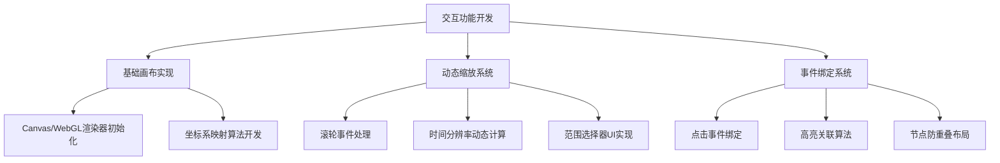

# timeline
一个支持大规模数据的高性能、可交互的时间轴工具。
---

# **1. 项目概述**
本应用旨在开发一个高性能、可交互的时间轴工具，支持大规模时间序列数据的可视化展示，并提供丰富的交互功能与附件管理能力。核心特色包括动态缩放、多类型附件支持、实时响应及大数据优化处理，适用于历史事件分析、项目管理、媒体内容展示等场景。

---

# **2. 核心功能**

## 交互功能
### 动态时间轴操作
- 支持鼠标拖拽横向滚动，滚轮缩放时间分辨率（小时/天/月）。
- 提供时间范围选择器，通过滑块或输入调整显示范围。
- 点击时间节点显示详细信息，高亮关联事件。
- 动态调整节点信息高度，避免重叠。

### 多轴协同与切换
- 支持多条时间轴协同缩放，以主轴为基准进行同步。
- 当数据密度变化时，通过动态补偿算法（如三次样条插值）智能调整刻度，保持整体布局对齐。

## 数据可视化与渲染
### 高性能渲染引擎
- 采用WebGL/Canvas实现，支持十万级以上时间节点的流畅展示。
- 时间刻度根据分辨率动态适配，并以颜色区分不同时间段。

### 大数据优化
- 实现虚拟滚动，仅渲染可视区域内的数据节点。
- 数据分片加载与聚合计算（如按天汇总），减轻前端渲染压力。

## 附件管理
### 多类型附件支持
- 允许在时间节点上添加图片、音频、文档链接、外部资源等。
- 附件以图标形式展示，点击可预览或下载。

### 附件存储与关联
- 通过云存储或本地索引管理附件元数据，并与事件ID关联。
- 支持批量导入/导出附件包（ZIP格式）。

---

# **3. 技术架构**

## **3.1 前端技术栈**
- **框架**: React (利用虚拟DOM优化渲染)
- **渲染引擎**: Canvas API (未来可扩展至WebGL)
- **状态管理**: React Context (用于管理时间轴状态与组件通信)

## **3.2 后端服务 (规划中)**
- **数据接口**: RESTful API (支持按时间范围分片查询)
- **存储方案**:
  - 时间序列数据: 时序数据库 (如 InfluxDB)
  - 附件文件: 对象存储 (如 MinIO)

---

# **4. 文件结构**
```
timeline/
├── src/                      # 前端源代码
│   ├── index.css             # 全局样式
│   ├── index.html            # Webpack HTML 模板
│   ├── index.jsx             # React应用入口文件
│   ├── TimelineApp.jsx       # 主应用组件
│   ├── TimelineContext.js    # 全局状态管理(Context)
│   ├── ControlPanel.jsx      # 控制面板(包含下方所有组件)
│   ├── FileUploader.jsx      # 文件上传组件
│   ├── ActionButtons.jsx     # 操作按钮组件
│   ├── PreviewPanel.jsx      # 文件内容预览组件
│   └── TimelineCanvas.jsx    # 时间轴画布渲染组件
├── static/                   # 生产环境构建输出目录
├── templates/                # 原始HTML模板 (已由 src/index.html 替代)
├── .gitignore                # Git忽略配置
├── app.py                    # Python/Flask 后端服务 (开发中)
├── package.json              # Node.js 项目配置与依赖
├── README.md                 # 项目说明文档
├── requirements.txt          # Python 依赖
└── webpack.config.js         # Webpack 配置文件
```
---

# **5. 开发与运行**

## **5.1 环境准备**
- Node.js (v18.x 或更高版本)
- Python (v3.8 或更高版本)

## **5.2 本地开发**
1. **安装前端依赖**:
   ```bash
   npm install
   ```
2. **启动前端开发服务器**:
   ```bash
   npm run dev
   ```
   应用将在 `http://localhost:8080` 上运行。

3. **启动后端服务** (如果需要):
   ```bash
   # (根据 app.py 的具体实现)
   pip install -r requirements.txt
   flask run
   ```

## **5.3 构建生产版本**
```bash
npm run build
```
构建后的静态文件将输出到 `static/` 目录。

---

# **6. 开发任务拆解**
## 开发流程图

