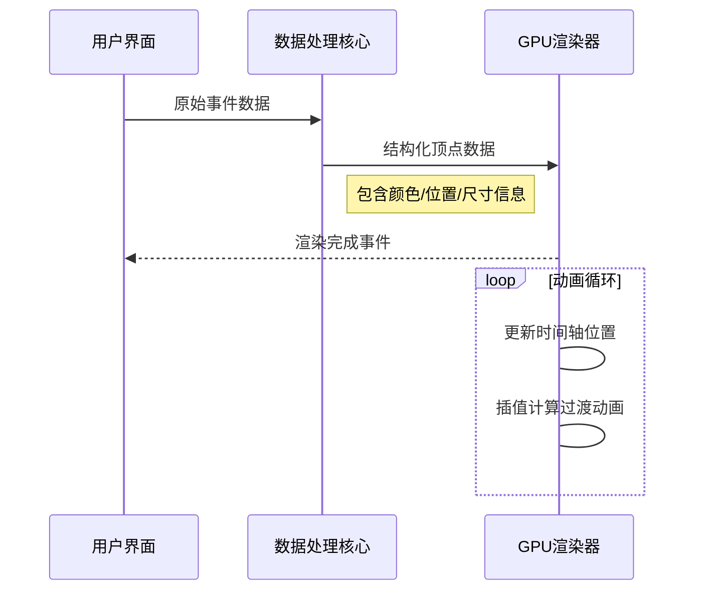
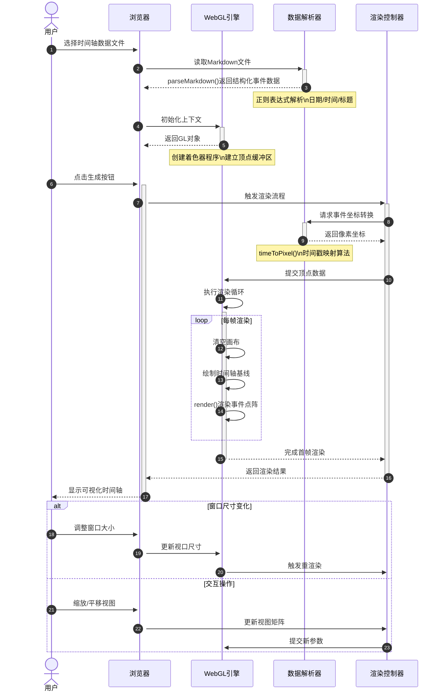

```mermaid
sequenceDiagram
    participant 用户界面
    participant 数据处理核心
    participant GPU渲染器
    
    用户界面->>数据处理核心: 原始事件数据
    数据处理核心->>GPU渲染器: 结构化顶点数据
    Note right of 数据处理核心: 包含颜色/位置/尺寸信息
    GPU渲染器-->>用户界面: 渲染完成事件
    loop 动画循环
        GPU渲染器->GPU渲染器: 更新时间轴位置
        GPU渲染器->GPU渲染器: 插值计算过渡动画
    end
```

```mermaid
sequenceDiagram
    autonumber
    actor 用户 as 用户
    participant 浏览器 as 浏览器
    participant WebGL引擎 as WebGL引擎
    participant 数据解析器 as 数据解析器
    participant 渲染控制器 as 渲染控制器

    用户->>+浏览器: 选择时间轴数据文件
    activate 浏览器
    浏览器->>+数据解析器: 读取Markdown文件
    数据解析器-->>-浏览器: parseMarkdown()返回结构化事件数据
    Note over 数据解析器: 正则表达式解析\n日期/时间/标题

    浏览器->>+WebGL引擎: 初始化上下文
    WebGL引擎-->>-浏览器: 返回GL对象
    Note over WebGL引擎: 创建着色器程序\n建立顶点缓冲区

    用户->>+浏览器: 点击生成按钮
    浏览器->>+渲染控制器: 触发渲染流程
    渲染控制器->>+数据解析器: 请求事件坐标转换
    数据解析器-->>-渲染控制器: 返回像素坐标
    Note over 数据解析器: timeToPixel()\n时间戳映射算法

    渲染控制器->>+WebGL引擎: 提交顶点数据
    WebGL引擎->>+WebGL引擎: 执行渲染循环
    loop 每帧渲染
        WebGL引擎->>WebGL引擎: 清空画布
        WebGL引擎->>WebGL引擎: 绘制时间轴基线
        WebGL引擎->>WebGL引擎: render()渲染事件点阵
    end
    WebGL引擎-->>-渲染控制器: 完成首帧渲染
    渲染控制器-->>-浏览器: 返回渲染结果
    浏览器-->>-用户: 显示可视化时间轴

    alt 窗口尺寸变化
        用户->>浏览器: 调整窗口大小
        浏览器->>WebGL引擎: 更新视口尺寸
        WebGL引擎->>渲染控制器: 触发重渲染
    else 交互操作
        用户->>浏览器: 缩放/平移视图
        浏览器->>渲染控制器: 更新视图矩阵
        渲染控制器->>WebGL引擎: 提交新参数
    end
```